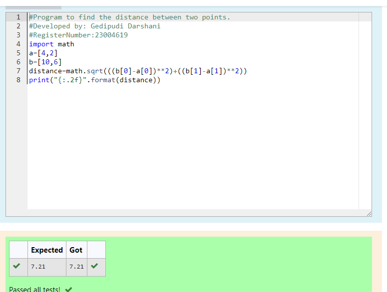

# DISTANCE-BETWEEN-TWO-POINTS

## AIM:
To write a python program to find the distance two 2 points
## ALGORITHM:
### Step 1: 
Import math to use the built-in functions for calculation.
### Step 2: 
Make a list of two given points to find distance.
### Step 3: 
Substitute the values in the distance formula  
### Step 4: 
Print the distance upto two decimals using the foramt.
### Step 5:
End the program. 
### PROGRAM:
``````
#Program to find the distance between two points.
#Developed by: Gedipudi Darshani
#RegisterNumber: 23004619
import math
a=[4,2]
b=[10,6]
distance=math.sqrt(((b[0]-a[0])**2)+((b[1]-a[1])**2))
print("{:.2f}".format(distance))
``````
### OUTPUT:

### RESULT:
Thus the solution for the distance between two points are successfully solved using python programming.